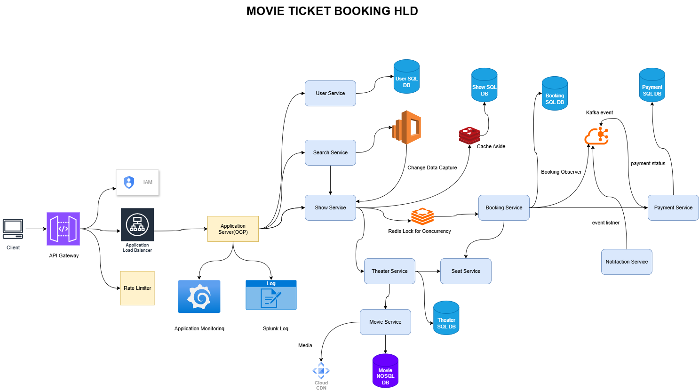

# 🎬 Movie Ticket Booking System

## 📌 Requirement Statement
The goal is to design and implement a **Movie Ticket Booking System** that enables users to **browse, select, and book movie tickets** seamlessly.  
The system should handle **theater management, show scheduling, seat booking, payments, and notifications** in a scalable and user-friendly manner.

---

## ✅ Functional Requirements

### 1. User Management
- User registration, login, and profile management.
- Role-based access: **Admin** and **Customer**.

### 2. Movie & Show Management
- Admin can **add, update, and remove movies**.
- Admin can **schedule shows** in specific theaters at specific times.
- Each show is linked to a **movie, theater, screen, and seat layout**.

### 3. Theater & Seat Management
- Theaters contain multiple screens.
- Each screen has a configurable **seating arrangement**.
- Seats categorized as **Silver, Gold, Platinum**.

### 4. Search & Browse
- Search movies by **name, language, genre, and location**.
- View available shows and theaters for a movie.

### 5. Booking & Payment
- Users select seats for a chosen show.
- **Real-time seat availability check** to prevent double booking.
- Multiple payment options (**UPI, Credit/Debit Card, Wallet**).
- Booking confirmation after successful payment.

### 6. Notifications
- Email/SMS confirmation for bookings.
- Details include **movie name, theater, time, seat numbers, and price**.

### 7. Cancellation & Refunds
- Users can cancel tickets before showtime.
- Refund processing (**full/partial**) as per policy.

---

## 🏗️ High-Level Design (HLD) Path

### 🗄️ Database Strategy
- **SQL (ACID transactions)** → `User`, `Booking`, `Payment`, `Theater`, `Show`.
- **NoSQL (flexible schema, read-heavy)** → `Movie` metadata (tags, cast, posters, descriptions).

**Reasoning**:  
- Bookings and payments require **strong consistency**.  
- Movies are **semi-structured and read-heavy**, better suited for **MongoDB/Cassandra**.  

---

### 🔑 Key Design Considerations

#### ⚡ Database Sharding & Replication
- **Read replicas** for read-heavy queries (User, Show).
- **Sharding** for write-heavy tables (`Booking`, `Payment`) by `user_id` or `booking_id`.
- **Geo-partitioning** to reduce latency (shards close to users).
- **Monitoring & autoscaling** for proactive scaling.

#### 🎟️ Seat Locking
- Lock TTL = **5 minutes** using Redis (`SET key EX 300 NX`).
- Store pending booking in DB with expiry.
- If payment fails/timeout → lock released.

#### 🔍 Search Service
- Use **Elasticsearch/OpenSearch** for free-text search and autocomplete.
- Indexing pipeline: **CDC → Kafka → ES Indexer**.
- Separate indices for **Movies, Shows, Theaters**.
- Geo-indexing for location-based results.

#### 🔄 Reliability & Event Handling
- **Kafka** for event-driven workflows (notifications, updates).
- **DLQ (Dead Letter Queue)** for failed events.
- **Outbox pattern** for guaranteed delivery during Kafka downtime.

#### 💳 Payment Consistency (Saga Pattern)
- Orchestrated **Saga**:  
  - Step 1: Booking created (pending).  
  - Step 2: Payment processed.  
  - Step 3: Booking confirmed.  
- If failure → **compensating transaction** (refund).

#### 📈 Scalability
- Stateless services with **horizontal autoscaling**.
- **Partition booking traffic by show_id** to reduce hotspots.
- Redis caching for **seat maps, user sessions, search results**.
- Asynchronous workflows to handle spikes.

#### 📨 Notification Service
- Multi-channel (Email, SMS, Push, WhatsApp).
- Kafka → Notification Service → Channel adapters.
- Retries with exponential backoff.
- DLQ + fallback to alternate channels.

#### 🌍 Geo-Distributed Deployment
- **Regional clusters** (India, US, EU).
- **Geo-DNS routing** to nearest region.
- CDN/Edge Gateways for static + auth caching.
- Cross-region replication for DR.

---

## 🚀 Capacity & Reliability Planning
- Target: **10M+ concurrent users**.
- **Massive caching** at CDN and Redis layer.
- **Sharded DBs** for bookings & users.
- **Kafka partitions** tuned for throughput.
- Rate-limiting & backpressure for peak loads.
- Redis Cluster with Sentinel/Elasticache for HA.

---

## ⚖️ Tradeoffs
- **Consistency vs Availability** → strong consistency for money/seats; eventual consistency for search.  
- **Latency vs Durability** → synchronous durability slower but safer; async faster but riskier.  
- **Complexity vs Simplicity** → Saga/Outbox add complexity but required for distributed reliability.  
- **Cost vs Performance** → scaling across regions improves latency but increases infra costs.

---

